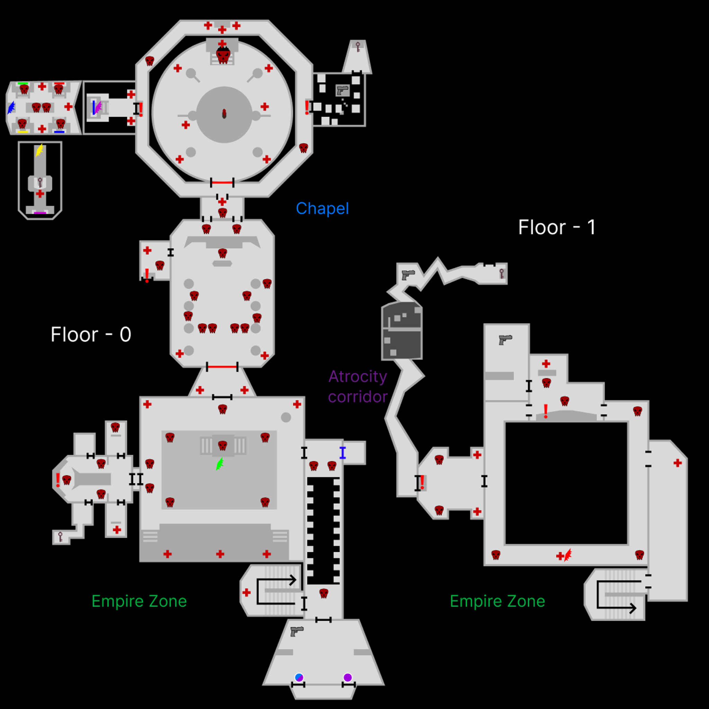

# Artifact of Annihilation (level design)
Made with Unity 6000.0.41f1

#### Target:
<strong><em>Capture the Imperial artifact and escape from their citadel.</em></strong>

#### Description:
Our protagonist is sent by the rebellion to a desert planet where he gets to the imperial citadel where a powerful artifact is kept.

After entering the citadel, the hero will traverse rooms and corridors trying to reach the guarded chapel where the artifact of annihilation is kept. During his wanderings, the hero will have to face numerous enemy hordes. In order to get to the chapel, he must find a key that opens a huge gate that may hide a terrific secret of the Empire.

Once the hero possesses the artifact, he will have to escape from the enemy citadel as soon as possible to avoid the summoned enemy reinforcements.

<em><a href="https://youtu.be/HnVpI4UF5-U" style="color:rgb(170, 0, 0);">Video of completing the level</a></em>

<em><strong>Used tools:</strong>
<ul>
    <li>Unity Engine 6000.0.41f1</li>
    <li>ProBuilder 6.0.5</li>
    <li>Blender 4.2 LTS</li>
    <li>Krita 5.2.6</li>
</ul>
</em>

<em>
<strong>Used assets from AssetStore:</strong>
<ul>
    <li><a href="https://assetstore.unity.com/packages/3d/characters/humanoids/sci-fi/sci-fi-space-soldier-polygonr-66384" style="color:rgb(71, 71, 71);">Sci Fi Space Soldier PolygonR</a></li>
    <li><a href="https://assetstore.unity.com/packages/3d/vegetation/plants/potted-plant-249570" style="color:rgb(71, 71, 71);">potted plant</a></li>
    <li><a href="https://assetstore.unity.com/packages/3d/props/interior/yughues-free-decorative-plants-13283" style="color:rgb(71, 71, 71);">Yughues Free Decorative Plants</a></li>
    <li><a href="https://assetstore.unity.com/packages/3d/environments/sci-fi/free-sci-fi-office-pack-195067" style="color:rgb(71, 71, 71);">Free Sci-Fi Office Pack</a></li>
    <li><a href="https://assetstore.unity.com/packages/3d/environments/occult-stone-pillars-281009" style="color:rgb(71, 71, 71);">Occult Stone Pillars</a></li>
    <li><a href="https://assetstore.unity.com/packages/3d/props/surveillance-camera-264577" style="color:rgb(71, 71, 71);">Surveillance Camera</a></li>
    <li><a href="https://assetstore.unity.com/packages/3d/props/interior/office-pack-free-258600" style="color:rgb(71, 71, 71);">Office Pack - Free</a></li>
    <li><a href="https://assetstore.unity.com/packages/3d/props/sofa-set-260566" style="color:rgb(71, 71, 71);">Sofa Set</a></li>
    <li><a href="https://assetstore.unity.com/packages/3d/environments/industrial/pipe-constructor-186974" style="color:rgb(71, 71, 71);">Pipe constructor</a></li>
</ul>
</em>